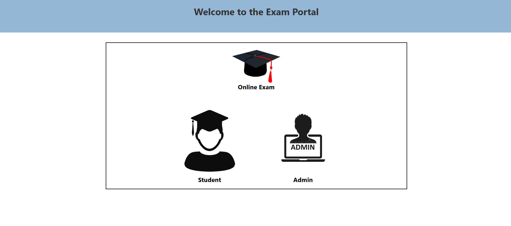
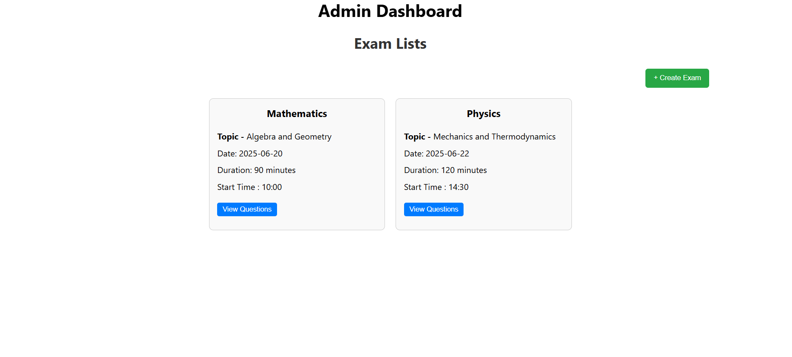
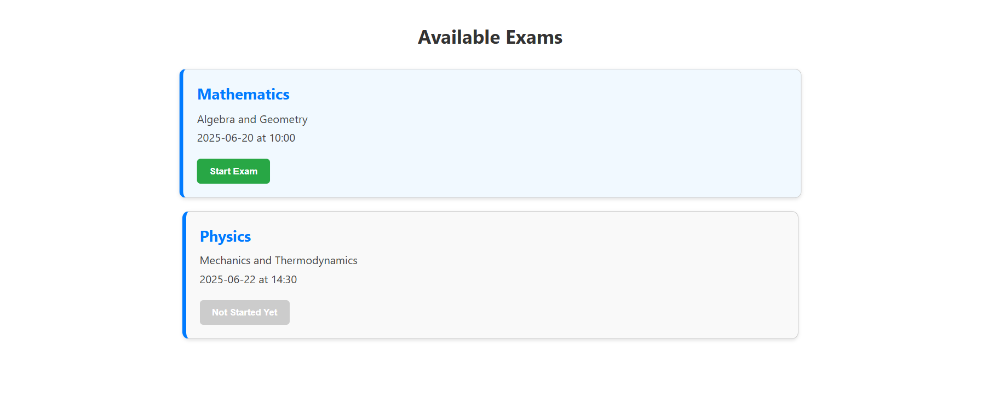

# Smart Exam Portal

A complete **offline/local exam system** for colleges and institutions. Designed to work on LAN without requiring internet access, this smart portal ensures secure, real-time exam management, monitoring, and evaluation.

> 🏆 Hackathon Project | 💼 Resume-Ready | 🔒 Internet-Free Local Exams

---

## 🛠️ Tech Stack

| Layer       | Technology          |
|-------------|---------------------|
| Frontend    | React.js, HTML/CSS  |
| Backend     | Node.js, Express.js |
| Database    | MongoDB (can be local instance) |
| Authentication | JWT / Session-based |
| Deployment  | Localhost + LAN     |

---

## 📸 Screenshots
 
 

 

---

## 🚀 Key Features

- 🔐 **Role-based Authentication**  
  Secure login for both **Admin** and **Student** users using JWT/session-based auth.

- 📝 **Exam Creation and Management**  
  Admins can create exams, define questions, set durations, and assign them to students.

- 🧑‍🎓 **Student Interface**  
  Clean and focused exam screen with timer, question navigation, and auto-save.

- ⏱️ **Timed Auto-Submission**  
  Exams automatically submit when time expires or on manual submission.

- 🕵️ **Cheating Prevention**  
  Includes optional **tab switch detection** and potential webcam monitoring (optional feature).

- 📊 **Automatic Evaluation**  
  Objective questions are auto-evaluated with immediate result calculation.

- 🌐 **Offline Capability**  
  Works entirely over LAN (localhost and private IPs), with no internet dependency.

- 💾 **MongoDB Integration**  
  All data—users, exams, responses, and results—stored securely in a local MongoDB instance.

---

## 🌟 Support

If you find this project useful or inspiring, please ⭐ the repo and share it with others!
